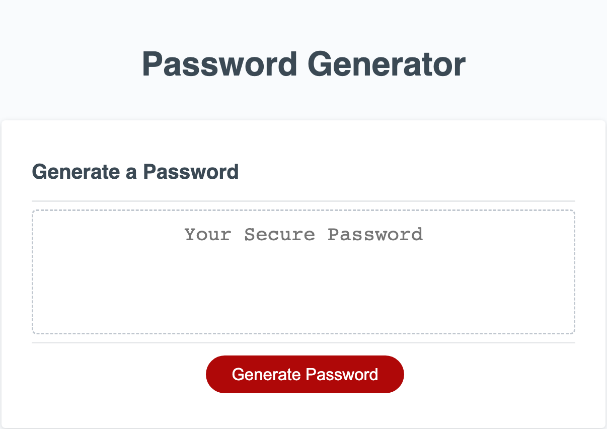

# Password Generator

## Description

This project involves taking an existing piece of code that showcases the front end of a password generator. My goal was to create the backend code that would allow a user to click the button and have a password generated based on some user inputs.

This assignment helped me understand multiple concepts such as:

-Creating prompts that allow for user input and selection. 
-Using these choices as variable inputs for other functions in my code. 
-Getting experience with the Console feature in Inspect Element to track my logic and artihmetic. 
-Using intermediate JavaScript methods such as Math.floor and Math.random 
 

## Installation

Create your own password using my password generator application at the following link: 

[Password Generator](https://shbunch.github.io/password-generator/)

 

## Usage

Simply click the 'Generate Password' button at the link. You will then be prompted with the following questions:

1. How many characters do you want?
2. Do you want to add: 
    A. Lowercase letters? 
    B. Uppercase letters? 
    C. Numbers? 
    D. Special characters? 

Once all options are selected, a unique and random password will be generated for you on the screen.

 

## Credits

SMU Coding Boot Camp - provided me with the starter HTML and CSS code

